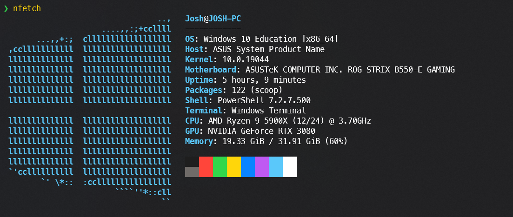

# Nfetch


_This project is still in active development don't expect everything to be working fully, and there will likely be breaking changes._

Nfetch is modern alternative to [neofetch](https://github.com/dylanaraps/neofetch) and [winfetch](https://github.com/kiedtl/winfetch), it's written in Go with a focus on performance, it's faster than both neofetch and winfetch and has no external dependencies.



[](https://asciinema.org/a/530825)

## Installation

You can download prebuilt binaries as well as OS packages (e.g. `.deb`) from the latest [release](https://github.com/jcwillox/nfetch/releases/latest), otherwise you can use the installer script.
Note: the installer script does not install completions, you can generate them using `nfetch completion <shell>`.

```bash
sh -c "$(curl -fsSL tinyurl.com/nfetch-sh)"
```

```pwsh
iwr -useb tinyurl.com/nfetch-ps1 | iex
```

## Usage

```shell
$ nfetch
```

You can also access more detailed information or use nfetch in script with the `raw` command which will output JSON formatted data.

```shell
$ nfetch raw host
{
  "hostname": "ubuntu-server",
  "uptime": 15382701,
  "bootTime": 1627190085,
  "procs": 296,
  "os": "linux",
  "platform": "ubuntu",
  "platformFamily": "debian",
  "platformVersion": "20.04",
  "kernelVersion": "5.4.0-80-generic",
  "kernelArch": "x86_64",
  "virtualizationSystem": "kvm",
  "virtualizationRole": "guest",
}
```

## Compatability

Support for more platforms will be added, but it's partly limited by what systems I can test on.

| Platform | x64 | x86 | ARM | ARM64 | Distros                                           |
|----------|-----|-----|-----|-------|---------------------------------------------------|
| Linux    | ✔️  | ✔️  | ⚠️  | ✔️    | Debian, Alpine, Kali, Proxmox, Slackware, AsusWRT |
| Windows  | ✔️  | ✔️  | ❌   | ❌     | Win10                                             |

✔️— Supported & Tested, ⚠️— Untested, ❌— Not supported

## Contributing

Rewriting neofetch is no small task so any help with that would be appreciated. You can also help by contributing to the upstream repositories that this project uses such as [shirou/gopsutil](https://github.com/shirou/gopsutil).
